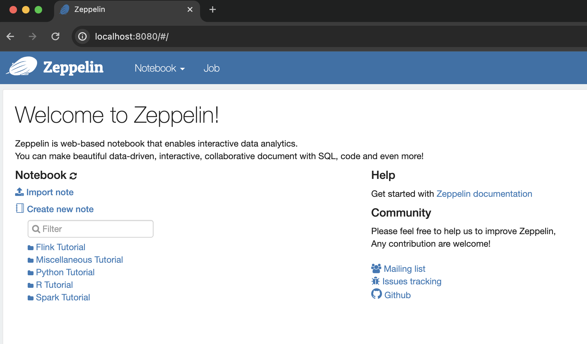

## 시작하기전에
- 제가 이 글을 작성하면서 사용한환경은 아래와 같습니다.
  - macOS : sonoma 14.4.1 (apple sillicon)
  - IDE : IntelliJ IDEA 2024.1
  - 이외 git, jdk17, nvm 등의 도구를 사용
- 그리고 이 글은 아래의 순서로 목차는 아래의 순서로 진행했습니다.
  - pache Zeppelin 프로젝트 Clone 
  - Node 환경세팅 (nvm 사용)
  - JDK 환경세팅 (IntelliJ IDE 사용)
  - Local 에서 띄우기

## Apache Zeppelin 프로젝트 Clone 
- 깃허브의 apache zeppelin 프로젝트 Repo (link : https://github.com/apache/zeppelin.git) 를 Clone 해옵니다.

```sh
git clone https://github.com/apache/zeppelin.git
```
- 개인마다 fork 를떠서 자신의 fork repo 에서 clone 해 진행을 해도 가능하지만 글에서 별도로 다루지는 않겠습니다.

## Node 환경세팅 (nvm 사용)
- Apache Zeppelin 의 로컬 개발환경 구축을 위해서는 node 개발환경이 필요합니다. 저는 [nvm](https://github.com/nvm-sh/nvm) 이라는 툴을 사용해서 node 버전을 세팅해줬습니다.
```sh
nvm install 16.20.2  # node16 버전 설치
nvm use 16  # node16 버전 사용 설정
```
- 위 명령어를 실행하고 나서 잘 설치되었는지 확인하는 명령어 입력
```sh
node -v && nvm ls
```
- v16.20.2 버전이 설치된것을 확인하였습니다
```txt
v16.20.2
->     v16.20.2
```
- 이 글을 작성하는 시점인 2024년 6월 기준으로는 node 버전으로 16을 사용하지만, 추후에 언제든지 변경될수 있습니다. 그래서 가끔은 package.json 파일을 확인해 프로젝트에서 사용가능한 특정 Node.js와 npm 버전을 확인해보는것이 좋습니다.
```txt
json
"engines": {
  "node": "~16.20.2",
  "npm": "~8.19.4"
}
```

## JDK 환경세팅 (IntelliJ IDE 사용)
- 저의 환경에서는 IntelliJ IDEA 라는 IDE (이하 IDEA) 를 사용해 프로젝트를 열어봅니다. 이 글 작성시점에는 2024.1 버전을 사용중입니다.
- IntelliJ 를 사용하면 자동으로 플러그인들이 추천되는데, 모두 설치해줍니다. (apache flink, spark, kafka 등..)
- 처음 열 경우 약간의 시간이 필요한데요, IDEA 에서는 파일들을 인덱싱하고 프로젝트 매니징 툴인 [Apache Maven](https://maven.apache.org/) (이하 메이븐 / maven) 이 개발을 위해 필요한 JDK & 라이브러리등을 자동으로 다운로드 받아줍니다.


## Local 에서 띄우기
- 이제 제플린 프로젝트를 로컬에서 실행시켜보겠습니다
```sh
./mvnw clean package -DskipTests && ./bin/zeppelin-daemon.sh restart
```
- 위 한줄명령어를 터미널에 입력하고 정상적으로 실행되었을때 아래의 정보들을 확인할수 있었습니다
```txt
## ~~ 중략 ~~
[INFO] BUILD SUCCESS
[INFO] ------------------------------------------------------------------------
[INFO] Total time:  04:35 min
[INFO] Finished at: 2024-06-08T11:23:49+09:00
[INFO] ------------------------------------------------------------------------
Please specify HADOOP_CONF_DIR if USE_HADOOP is true
Zeppelin stop                                              [  OK  ]
Zeppelin start 
```
- 제플린을 로컬에서 실행한 모습

- 제플린을 웹 브라우저를 통해 확인해봤는데요, 정상적으로 로컬에서 개발환경을 구축하는데 성공했습니다! 👍👍👍👍


## 참고문서
- https://macan.tistory.com/11