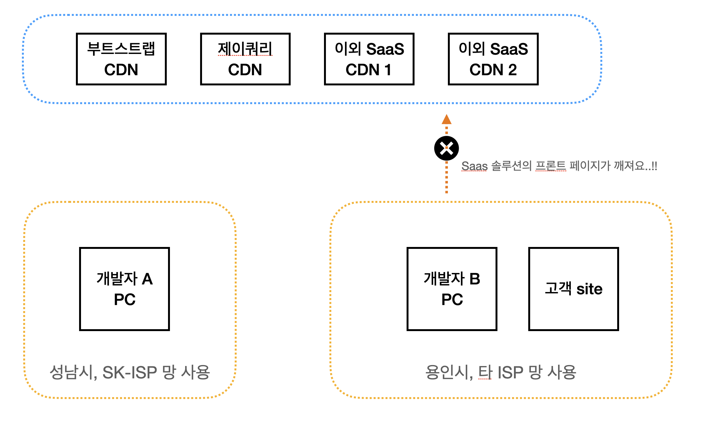
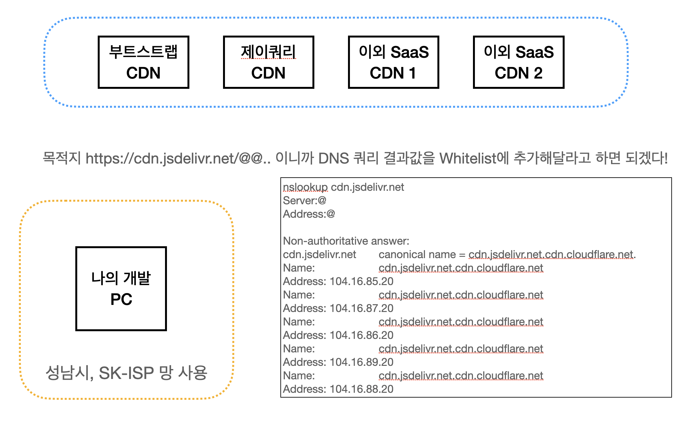
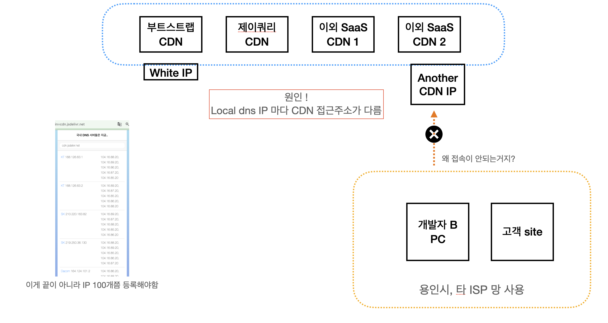

# DNS 주소는 도메인 단위로 허용해야하는구나!  를 배운 SSUL

## 발단
- 돈이많고 보안이 빡센 굴지의 대기업 횽이 우리 서비스를 자기네 사업장에서 돌리보고 싶어 하셨었습니다. 
- 그래서 요구사항도 열심히 수용해서 개발두 하고, 이런저런 절차들을 통과할때쯤 문제가 생겼는데요
- "프론트가 깨져요" 라는 이슈가 생겼어요. 
- 왜 프론트가 깨지는지 확인을 해 보니까, 이 대기업횽네는 보안이 무지 빡세서 퍼블릭 망이긴 한데, 네트워크가 whitelist 정책이라서 허용된 IP 이외에 모든 네트웍 접근에 대해서 timeout error 를 날려주시는 차도남같은 차가운 보안정책이였던 것이였어요.
- 처음에 우리 서비스 연결할때도 ip 를 허용해주고 nat 대역을 어디까지 쓰고 했던터라 아 이것도 등록하면 되는구나 하고 생각을 했었답니다



## 트러블슈팅
- 그래서 크롬디버거창을 보니 외부 Saas 서비스로 가는 CDN이 막혀있었고, 동일한 외부 Saas 서비스에서 프론트에 사용되는 bootstrap, jquery CDN 이 막혀서 프론트가 깨지는 원인 이였습니다.
- 처음에는 domain name 을 기준으로 whitelist 에 등록하려고 했지만, 이 굴지의 대기업형님 보안이 빡세서 domain 기준으로는 whitelist policy 에 등록이 안된다네요 ..ㅠ 
- 하는수없이 `nslookup` 명령어로 도메인 뒤에 있는 IP/VIP 를 한땀한땀 가져와 등록해주는수밖에 없었습니다. 



## 그런데 말입니다

- 고객site 에서는 여전히 프론트가 깨지고 dns로의 접근이 허용되지 않는 문제가 있었습니다.
- 무슨 문제인거지..? 정말 몰랐는데 정말 실력좋은 팀원분께서 원인을 알려줘서 문제를 해결할수 있었습니다



- 제가 인터넷을 제공받는 ISP, 그리고 개발 PC 에 설정된  local dns 주소에 따라서 CDN 의 접근 주소가 달라진다는 사실을 처음 알게 되었습니다.
- 실제로 아래의 사이트에서는 ISP 와 DNS 회사들마다 CDN 도메인을 바라보는 IP 주소가 다르다는걸 알수 있었습니다 
```
https://checkdnskr.appspot.com/
```

## 프롤로그
- cdn 을 그냥 단순한 캐싱서버정도로 피상적으로 알고 있었는데, 조금 더 알게 된 느낌 입니다. 프로그래밍도 좋지만 네트워크 & 인프라 공부도 틈틈히 해두면 좋을꺼같습니다.

- 참고자료
  - https://tech.kakao.com/2014/05/29/anycast/
  - https://www.cloudflare.com/ko-kr/application-services/products/dns/
  - https://www.cloudflare.com/ko-kr/learning/dns/what-is-anycast-dns/